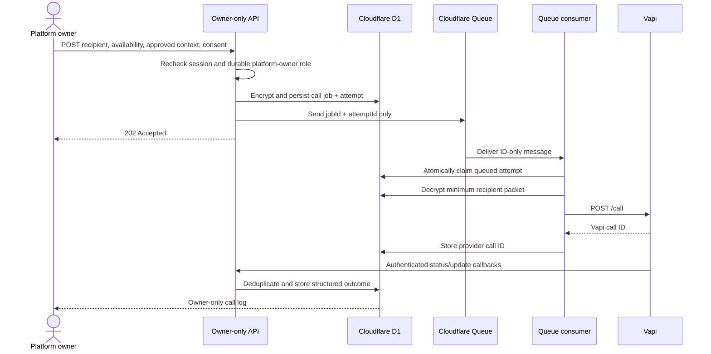

# Owner-only Vapi call automation

## Current technical flow

The call feature is asynchronous. The dashboard request never waits for Vapi
to place a call.



If the initial queue send fails, the job remains `scheduled`. The existing
minute cron scans due attempts and re-enqueues them. Duplicate queue delivery
is safe because only an attempt in the local `queued` state can be claimed.
After Vapi accepts it, the attempt moves to `provider_queued`, so a duplicate
message cannot place a second call.

## Authorization and privacy

- `platform_operators` is the durable authorization source. A verified email
  listed in `config/company.json` may create the initial internal
  `platform_owner` row once; later requests authorize by internal `userId`, not
  by Auth0 email or claims.
- Every call job and attempt retains `workspaceId`, even though an active
  platform owner may review logs across workspaces.
- Recipient name, phone number, dental availability, approved context, result
  summary, and selected availability are encrypted with
  `CALL_DATA_ENCRYPTION_KEY`.
- Queue messages contain only `jobId`, `attemptId`, and schema version.
- The webhook inbox stores only call ID, event type, status, ended reason, and
  timestamp. Recordings are never retained, and no transcript text reaches the
  inbox.
- Call creation requires a same-origin request, documented-consent checkbox,
  an E.164 phone number, bounded context, and an IANA time zone.

## Live operator view

`/dashboard/admin/calls` shows the call automation queue and, while a call is
connected, the transcript as it is spoken. The console polls
`GET /api/v1/admin/calls/live` every two seconds during a call and every eight
seconds otherwise; a backgrounded tab drops to the idle interval.

The transcript is deliberately disposable:

- Vapi `transcript` callbacks are accepted alongside `status-update` and
  `end-of-call-report`. Only `transcriptType: "final"` lines are stored, so a
  partial that rewrites itself several times per second never reaches D1.
- Lines land in `call_transcript_lines`, encrypted with
  `CALL_DATA_ENCRYPTION_KEY` and capped at 2,000 characters each.
- They bypass the provider inbox. An inbox row is permanent, and a transcript
  is not; a unique `(attempt_id, fingerprint)` index provides idempotency for
  replayed deliveries instead.
- `finishCallAttempt` deletes an attempt's lines as it records the outcome, and
  a line arriving after the attempt leaves a live state is dropped rather than
  stored. The minute cron sweeps anything a lost end-of-call callback left
  behind, and any line older than sixty minutes regardless of attempt state.

What survives a call is what survived before this view existed: the structured
outcome, the summary, and the selected availability. Reading the live view
requires platform-operator authorization, matching the `outreach.transcript`
field already reserved to operators in `lib/openchair/projections`.

## Outcome and retry policy

The preferred Vapi end-of-call structured result contains:

```json
{
  "outcome": "confirmed | declined | reschedule_requested | no_answer | busy | voicemail | wrong_number | do_not_call | unclear | technical_failure",
  "recipientReached": true,
  "appointmentConfirmed": true,
  "followUpRequired": false,
  "summary": "Short operational summary",
  "selectedAvailability": "Selected appointment window or null"
}
```

`confirmed`, `declined`, `wrong_number`, and `do_not_call` are terminal.
`reschedule_requested` and `unclear` require owner review. `no_answer`, `busy`,
`voicemail`, and a known technical failure retry after 15 minutes and then
four hours, up to the configured job maximum. An ambiguous dispatch failure is
sent to owner review rather than risking a duplicate call.

The retry schedule applies only while a job's attempt budget allows it, and
each caller sets its own. OpenChair outreach creates jobs with
`maxAttempts: 1`, so a `no_answer` there advances to the next candidate instead
of retrying — see [OpenChair Vapi MVP bridge](openchair/vapi-mvp.md).

## Local configuration

Copy the Vapi and encryption entries from `.env.example` into `.env.local`:

- `VAPI_API_KEY`: private Vapi server key.
- `VAPI_ASSISTANT_ID`: the assistant configured for appointment confirmation.
- `VAPI_PHONE_NUMBER_ID`: the Vapi outbound phone number.
- `VAPI_WEBHOOK_TOKEN`: random token of at least 24 characters.
- `CALL_DATA_ENCRYPTION_KEY`: random secret of at least 32 characters.
- `VAPI_API_BASE_URL`: Vapi API origin; defaults to `https://api.vapi.ai` and
  is overridden only to point at a stub during local testing.

Configure the Vapi server URL as:

`https://<public-host>/api/webhooks/vapi`

Configure a Vapi Custom Credential to send
`Authorization: Bearer <VAPI_WEBHOOK_TOKEN>`. A tunnel is required for Vapi to
reach a localhost webhook; the outbound queue and dashboard can still be
tested entirely in Wrangler local mode.

## Staging boundary

The repository declares distinct planned queue names:

- local: `built-different-call-automation-local`
- local dead letter: `built-different-call-automation-local-dlq`
- staging: `built-different-call-automation-staging`
- staging dead letter: `built-different-call-automation-staging-dlq`

This implementation does not create those remote resources, upload secrets,
apply staging migrations, or deploy. Before a staging deployment, create the
two staging queues in the approved Cloudflare account, configure the four Vapi
and encryption secrets/variables in the staging secret manager, review
migration `0008`, and run the existing staging dry-run command.
